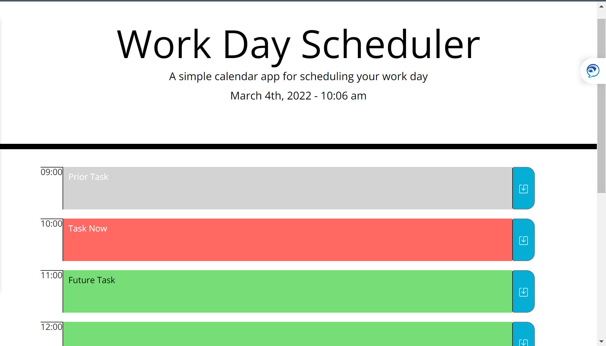

# workdaysched

Set Schedule for 9-5pm regular workday.

Time slots change depending on time of the day, if it is past, present or future. 

Each slot saves into local storage and items persist when returning to the application at different times. 

https://frivera14.github.io/workdaysched/
https://github.com/frivera14/workdaysched

